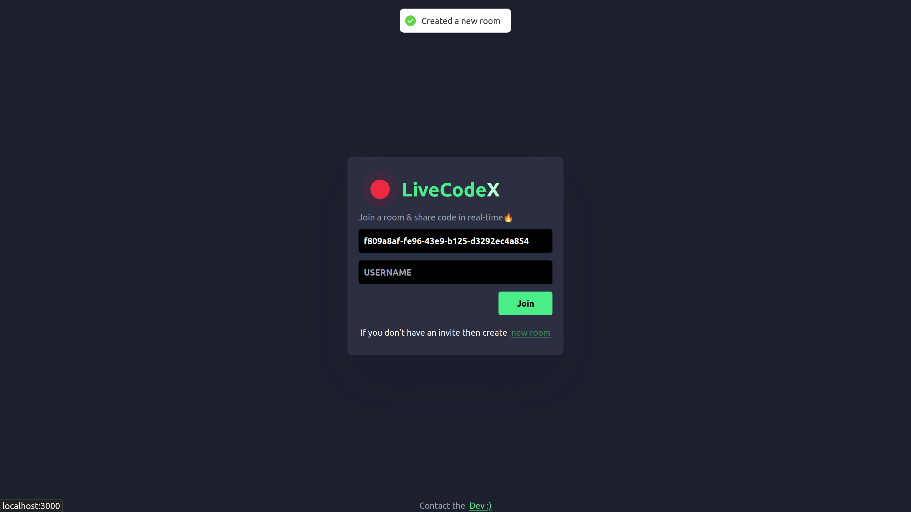
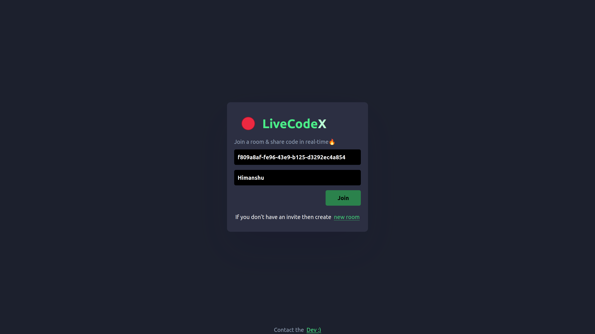
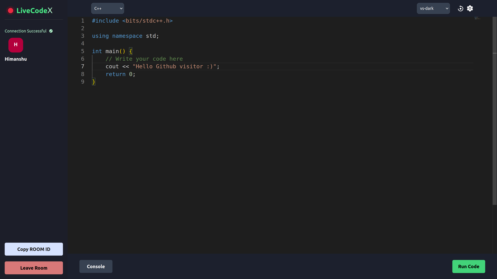
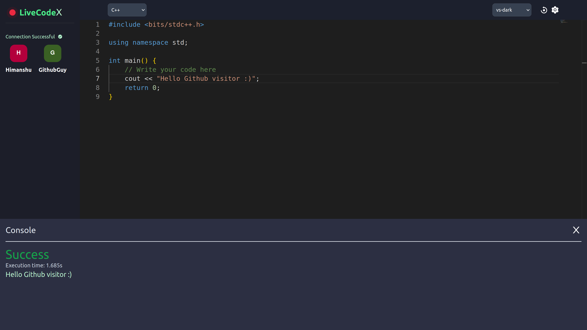
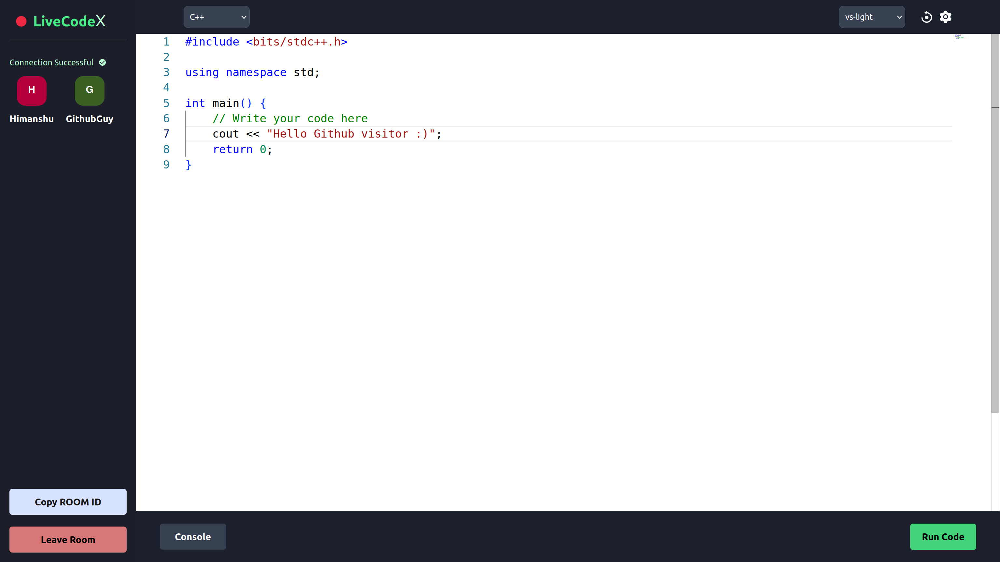
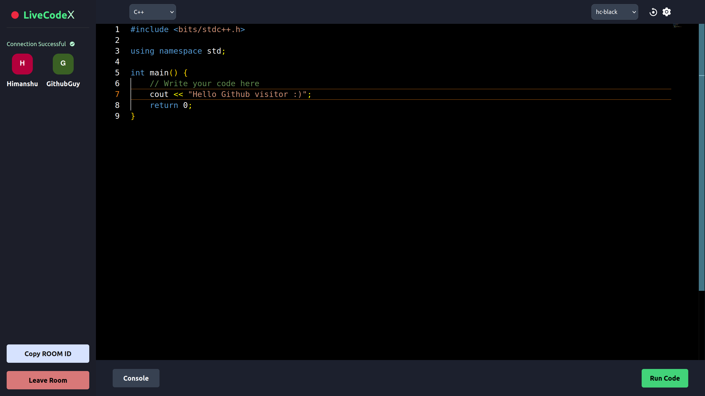

# LiveCodeX

#### LiveCodeX, an innovative real-time coding web application with an inbuilt code editor and real-time sync capabilities, enabling users to collaborate and evaluate their coding skills effectively.

## Screenshots: 
#### Create Room Feature
https://github.com/himanshu070/LiveCodeX/assets/66140981/df9c01f5-f375-4442-a9af-784c8ab2bf89

## More info about LiveCodeX:
Welcome LiveCodeX IDE! This application is built using Next.js and incorporates a code compiler feature using child processes. The IDE provides a collaborative coding environment where users can join a room and write code together. Additionally, it offers various themes and fonts to enhance the coding experience.

## Features

- Collaborative Coding: Users can join a room and collaborate on code in real-time.
- Code Compiler: Utilizing child processes, the IDE can compile and execute code.
- Themes and Fonts: Users can choose from a variety of themes and fonts to customize their coding environment.

## Technologies Used

The Next.js Code Collaboration IDE is built using the following technologies:

- Next.js: A popular React framework for building server-side rendered applications.
- Socket.io: A library that enables real-time bidirectional communication between the client and the server.
- Child Processes: Used to execute code compilation and execution as separate processes.

## Getting Started

To get started with the Next.js Code Collaboration IDE, follow these steps:

1. Clone this repository to your local machine.
2. Install the necessary dependencies using npm install.
3. Start the development server using npm run dev.
4. Access the application by navigating to `http://localhost:3000` in your web browser.

## Usage

Once the LiveCodeX IDE is running, follow these steps to utilize its features:

1. Open the IDE in your web browser.
2. Create a new room or join an existing room by entering the room ID.
3. Start collaborating with others in real-time by writing code together.
4. Use the provided compiler feature to compile and execute the code.
5. Customize your coding environment by selecting different themes and fonts.

## Contact

For any inquiries or further information, please contact me at [mishrahimanshu070@gmail.com](mailto:mishrahimanshu070@gmail.com).

Enjoy using LiveCodeX IDE with its collaborative coding and customization features!

